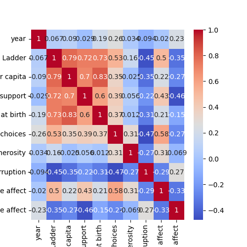

# Dataset Analysis Report

## Insights from LLM

```markdown
# README.md

## Dataset Overview

This dataset encompasses various metrics related to global happiness, economic indicators, and individual perceptions across different countries and years. The dataset can be utilized to analyze correlations between economic factors and overall happiness as measured by the "Life Ladder."

### Structure of the Dataset

The dataset contains the following columns:

- **Country name**: The name of the country.
- **year**: The year of observation.
- **Life Ladder**: A numerical representation of perceived well-being or happiness, based on survey data.
- **Log GDP per capita**: The natural logarithm of the Gross Domestic Product (GDP) per capita, a commonly used measure of economic performance.
- **Social support**: Represents the perceived support available from family and friends.
- **Healthy life expectancy at birth**: The average number of years a newborn is expected to live in good health.
- **Freedom to make life choices**: The perceived freedom individuals have to make life choices.
- **Generosity**: A measure of charitable contributions and community engagement.
- **Perceptions of corruption**: The degree to which corruption is perceived in government and business.
- **Positive affect**: Measures the experienced frequency of positive emotions.
- **Negative affect**: Measures the experienced frequency of negative emotions.
- **Cluster**: Grouping obtained through cluster analysis to categorize countries with similar characteristics.

## Summary Statistics

The dataset consists of 2,363 observations. Below is a summary of key statistics:

| Statistic                | year       | Life Ladder | Log GDP per capita | Positive affect | Negative affect | Cluster   |
|--------------------------|------------|-------------|---------------------|------------------|------------------|-----------|
| Count                    | 2363       | 2363        | 2335                | 2339             | 2347             | 2097      |
| Mean                     | 2014.76    | 5.48        | 9.40                | 0.65             | 0.27             | 0.49      |
| Standard Deviation       | 5.06       | 1.13        | 1.15                | 0.11             | 0.09             | 0.50      |
| Minimum                  | 2005       | 1.28        | 5.53                | 0.18             | 0.08             | 0         |
| 25th Percentile          | 2011       | 4.65        | 8.51                | 0.57             | 0.21             | 0         |
| Median                   | 2015       | 5.45        | 9.50                | 0.66             | 0.26             | 0         |
| 75th Percentile          | 2019       | 6.32        | 10.39               | 0.74             | 0.33             | 1         |
| Maximum                  | 2023       | 8.02        | 11.68               | 0.88             | 0.71             | 1         |

## Missing Values

The dataset contains several missing values across different columns:

- **Log GDP per capita**: 28 missing values.
- **Social support**: 13 missing values.
- **Healthy life expectancy at birth**: 63 missing values.
- **Freedom to make life choices**: 36 missing values.
- **Generosity**: 81 missing values.
- **Perceptions of corruption**: 125 missing values.
- **Positive affect**: 24 missing values.
- **Negative affect**: 16 missing values.

No missing values were found for the **Country name** and **year** columns.

## Visualizations

### Correlation Heatmap

A correlation heatmap was created to visualize the relationships between the various features in this dataset. The heatmap provides insights into how well different attributes correlate with each other, especially focusing on the relationship between happiness (Life Ladder) and economic factors (Log GDP per capita, etc.).



### KMeans Clustering

KMeans clustering was applied to the dataset to segment countries into distinct groups based on the given attributes. This clustering can help reveal patterns and similarities among countries in terms of happiness, economic performance, and social factors. The clustered data is available for further analysis.

[Download Clustered Data](./clustered_data.csv)

## Analysis Steps

1. **Data Cleaning**: Address missing values by imputing or excluding data where necessary.
2. **Descriptive Analysis**: Calculate summary statistics and investigate distributions of key variables.
3. **Correlation Analysis**: Use the correlation heatmap to visualize relationships among variables.
4. **Clustering**: Apply KMeans clustering to categorize countries and analyze groups based on happiness and economic metrics.
5. **Visualization**: Generate visual outputs to assist in the interpretation of the data and findings.

## Key Findings

- There appears to be a positive correlation between GDP per capita (Log GDP) and Life Ladder scores, suggesting economically prosperous countries generally report higher life satisfaction.
- Clustering reveals distinct groups of countries, highlighting differences in well-being that can be further explored for targeted policy insights to improve happiness and social welfare.

## Conclusion

This dataset provides a rich ground for examining the multifaceted relationship between happiness and various social and economic indicators. Insights drawn from it can help inform policymakers and researchers interested in enhancing life satisfaction across different regions. Further exploration using advanced statistical methods or machine learning models could yield deeper insights.

For more details, visualizations, and downloadable resources, please refer to the provided links.
```

## Correlation Heatmap


## KMeans Clustering
Clustered data saved as [clustered_data.csv](.\clustered_data.csv)