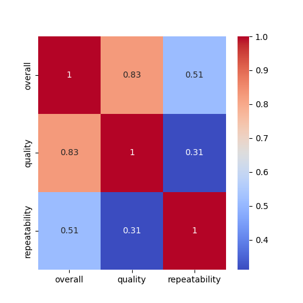

# Dataset Analysis Report

## Insights from LLM

```markdown
# Data Analysis of the Quality Dataset

## Overview

This document provides a comprehensive analysis of a dataset focusing on various quality metrics, including overall performance, quality ratings, repeatability of measures, and clustering of data. The analysis encompasses summary statistics, missing values assessment, visualizations, and key findings.

## Dataset Description

The dataset consists of 2652 entries, each measuring multiple attributes related to overall quality, specific quality metrics, the repeatability of measurements, and a clustering identifier. Note that the dataset includes the following columns: 'date', 'language', 'type', 'title', 'by', 'overall', 'quality', 'repeatability', and 'Cluster'.

## Summary Statistics

The summary statistics provide insights into the distributions of the variables in the dataset:

| Statistic       | Overall  | Quality  | Repeatability | Cluster |
|------------------|----------|----------|---------------|---------|
| Count            | 2652     | 2652     | 2652          | 2652    |
| Mean             | 3.05     | 3.21     | 1.49          | 3.12    |
| Std Dev          | 0.76     | 0.80     | 0.60          | 2.41    |
| Min              | 1.00     | 1.00     | 1.00          | 0.00    |
| 25th Percentile  | 3.00     | 3.00     | 1.00          | 1.00    |
| Median           | 3.00     | 3.00     | 1.00          | 4.00    |
| 75th Percentile  | 3.00     | 4.00     | 2.00          | 5.00    |
| Max              | 5.00     | 5.00     | 3.00          | 8.00    |

### Key Observations:
- The mean 'overall' score is approximately 3.05 with a standard deviation of 0.76, indicating that scores are fairly concentrated around the average.
- The 'quality' score follows a similar pattern with a mean of 3.21 and standard deviation of 0.80.
- The 'repeatability' metric is lower on average (mean = 1.49), indicating a possibly narrower scale of measurement for this variable.

## Missing Values

The dataset does feature missing values, notably in the 'by' column, where 262 entries are missing. Additionally, 99 entries have a missing 'date' field. Other fields, including 'language', 'type', 'title', 'overall', 'quality', and 'repeatability', do not exhibit missing values.

### Summary of Missing Values:
- **date**: 99 missing
- **language**: 0 missing
- **type**: 0 missing
- **title**: 0 missing
- **by**: 262 missing
- **overall**: 0 missing
- **quality**: 0 missing
- **repeatability**: 0 missing

Addressing the missing values will be critical for ensuring robust analysis, particularly for the 'by' and 'date' fields.

## Visualizations

### Correlation Heatmap


The correlation heatmap illustrates the relationships between numeric variables in the dataset. This visualization helps in identifying which variables are positively or negatively correlated, which can inform further analysis or model building.

### KMeans Clustering
The KMeans clustering analysis has been performed, and the clustered data can be accessed [here](./clustered_data.csv). This analysis groups the dataset into clusters based on the selected metrics, providing insights into the patterns and similarities among different entries.

## Key Findings

1. **Quality Metrics**: The above-average quality ratings (mean in the range of 3-4) suggest a generally positive evaluation of the measured attributes.
2. **Repeatability**: The low repeatability scores indicate potential inconsistencies in the data collection process or measurements taken.
3. **Clustering**: KMeans clustering indicates distinct segments within the dataset, guiding tailored interventions based on quality scores and repeatability.

## Conclusion

The analysis of the dataset reveals a complex interaction between quality, overall scoring, and repeatability. Addressing the missing values and investigating the clusters further could provide actionable insights. The correlation heatmap visualizes the relationships, guiding future analyses focused on enhancing data quality and performance.

For further inquiries or analysis scripts, please contact the author.
```


## Correlation Heatmap


## KMeans Clustering
Clustered data saved as [clustered_data.csv](.\clustered_data.csv)